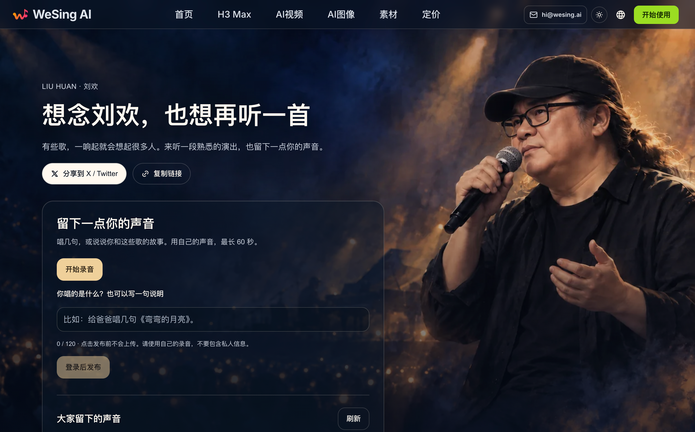
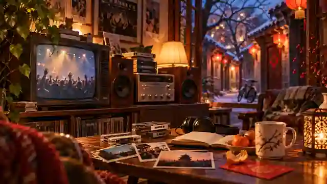
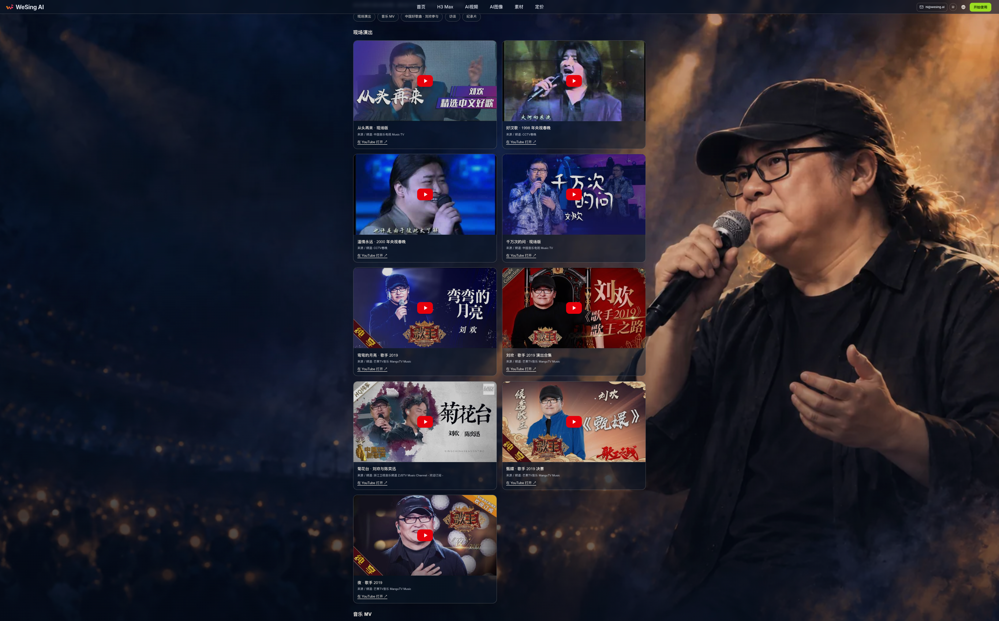

# 为什么先做刘欢子站：一份关于创造的项目记录

## 一、这个项目的起点，不是一张功能清单

我造了个子站来纪念刘欢。

这句话比任何产品说明都接近我的本意。平时介绍一个项目，很容易先讲它能做什么；这一次，我想先讲我为什么非得给这些作品和回忆找个地方。功能可以继续讨论，理由却已经在我的生活里放了很多年。

先把当前的样子交代清楚：[这个项目的工具主站 wesing.ai](https://wesing.ai/) 是为子站才仓促上线的。主站定位是工具站，音乐功能尚未添加，现在不能用它生成音乐。我不打算把尚未完成的部分写成已有能力。

先做出来的，是[刘欢音乐记忆子站](https://liuhuan.wesing.ai/)。它收录现场演出、MV、综艺高光、纪录片、访谈；登录后，可以留下60秒的歌和一小段话，共同纪念刘欢与他的作品。这就是眼下可以说明白的内容。

这个念头并不来自一个特别宏大的判断。是一些片尾曲、一些人和地方，到了今天还留在我脑子里。既然总惦记着，不如先做一件具体的事。接下来这段，算是我给项目写的缘起，而不是给一个歌手写的完整履历。

## 二、真正让我动手的，是这些不整齐的回忆

我今天相信，竞争获得的零和胜利不值一提，人生的成就全部来自创造。拿这个角度看刘欢，他不只唱，不只写，还扶持过不知多少有才华的后辈，造过属于几代人的时事。在我心里，这样的创造，此生足矣。

但我不是先想出这套话，再去找歌曲证明它。恰好相反，是许多具体的日子慢慢走过来，才有了今天的想法。

最早的一段，和我爸的工作有关。他年轻时候做电视剧制片主任，有部讲九十年代高中生的电视剧，叫《第三军团》。我记得豆瓣评分8分多，年轻的王砚辉演男二。刘欢为这部戏献唱主题曲《他们我们》。

> 我们都是一步一步跋涉过来/他们也要一步一步奋斗下去/当年我们也像他们现在一样/以后他们是否也像现在我们

当时我读小学，片尾曲给我的印象，却不太像一部高中生故事该有的感觉。那里面有种苍凉，和剧情不同。小孩子不懂怎么解释这种意境，只能先记住。回头看，这倒是音乐留在我这里的一种方式：不必等到理解，已经先有了感受。

再一段是1998年。下岗潮的时候，北京社会上刮起彩票风，我爸会带我上街买彩票。场地常是一块空旷的黄土地，铁皮围挡把很大一片圈住，里头是摆满彩票的长条桌子。

在我的记忆中，当时北京所有这类彩票站，都拿大喇叭循环放《从头再来》，别的仿佛都没有。

> 心若在/梦就在/天地之间还有真爱/看成败/人生豪迈/只不过是重头再来

刘欢越唱，我爸越上头；我爸一直买，就一直重头再来。眼看我妈都急了，居然真中出一套家庭组合音响。我印象挺深，我爸刮出来的是个黑桃，也不是草花K。我印象深的是另一件事：我们俩举着、挥着那张彩票，在歌声里往领奖台冲。

把这个经历写成一句“听歌受到鼓舞”，就全没味了。那里还有我爸停不下来的购买热情，我妈的着急和我们最后的得意。生活比概括好笑多了，所以细节还是得留着。

《水浒传》播的时候，我五年级，姥姥家是我常住的地方。那时阜成门还没有后来那些国企集团拥挤占据的样子。春节的小胡同，我和表弟表妹提着灯笼跑过去，暖融的烛光一晃，长长的影子也跟着忽闪。

到了每集片尾，表弟就会跟唱刘欢：

> 大河向东流哇/天上的星星参北斗哇

他当年五音不全，这些年有没有唱好些，我不知道，已经多年没有相见。甚至那个年代留在脑子里的刘欢，上次被我重新想起，也还是通过《喜人奇妙夜》里的《越狱的夏天》。那个故事真的好，听见唢呐起来，我掉了眼泪。

我想保存的就是这样一层关系：说的是作品，绕不开的却还有表弟的声音。视频可以再看，小时候一起跑过的那个人，如今却未必常能见到。

初中时回宁波老家过新年，又是另一段。照我的亲身体会，浙江人睡觉极早，我从没有一年把春晚看完，却总想再多看几集《西游记后传》。现在问剧情，已经记不得了；问好不好看，记得出乎意料地好；问打斗，粗糙得离谱。

顺便交代我一直有的吐槽：伟大作品里粗糙到离谱的两件事，是《西游记后传》的武打，以及《天道》的背景音乐。前者的音乐反而好得很，刘欢唱的这段到现在还在我脑子里：

> 我欲成仙/快乐齐天/变化出神话在风中流传/真心走过/每个瞬间/才能对孩子款款笑谈/我欲成仙/快乐齐天/让自己对得起美丽寓言/天降我在/天地之间/总得有故事让后人看

上面是默写，过去26年了，哪里记错很正常。我不想假装记忆像文档一样准确：细部会跑掉，但当时觉得好听、觉得想继续看，这些感受还在。

听歌有时也不需要把故事补全。我一次都没看过《宝莲灯》，《甄嬛传》也没看完，照样觉得《天地在我心》和《凤凰于飞》不是一般的好听，而是在定义“高级的好听”。

不过，喜欢不妨碍我嘀咕：他是懒吗？主歌近关系转调完，直接就给副歌了。哈哈，这个槽我一直想吐，为什么能这样，而且真的可行？可能人家的创造实在太结实，懒得有恃无恐。你在这边琢磨，他那边已经把歌稳稳写成了。

再后来，《中国好声音》《中国好歌曲》那阵，我在国企工作，还赶上一个很闲的闲差。新面孔带着无比高妙的原创作品扑过来，我恰好有充足时间沉在其中，精神世界无比充实幸福。

那是2010年代。一批因为音综被选中的歌手、唱作人，从五湖四海汇聚北京。百子湾、北京像素、欧尚羽毛球馆，刘欢的战队，以及常石磊的“歌不动听请退群”微信群，串起了我对那段时间的记忆。

我高中、大学时在金帆团唱了多年合唱和阿卡贝拉，群里很多唱作人又是朋友，但我一次申请入群都没敢提过。这不是个能用“喜欢音乐就进去聊聊”轻轻带过的心情。

音乐这东西，不懂时会觉得就那样儿，你上你也行。等你懂了，也真努力过，三秒钟就够了：这人、这作品，要不要跪着听，你心里明白。距离有时候不是不懂造成的，是懂了以后才量出来的。

2018年，我去金韩一的追悼会。北京的歌手圈子那时已经四散而去，大家为了曾经的回忆，短暂再次聚起来，看看熟悉的面孔现在是否还好。许多人喝了一通宵，吐在酒馆里，也有人睡在马路上。

杯子碰在一起，都是梦想破碎的声音。

这些经历并没有被后来一句“怀念青春”覆盖掉。充实幸福的日子、彼此的才华，还有最后那份苦涩，我都记得。也正因如此，比起谁赢过谁，我更在乎究竟创造过什么，给别人的生活留下过什么。

## 三、下一步做什么，希望从留言里找答案

这就是项目的缘起。与其说我想搭一个内容齐全的网站，不如说，我先想给这些不能互相替代的记忆留个地方。

眼下，收录影像、登录后留下60秒的歌和一小段话，是已经确定的部分。未来要增加什么模块，欢迎大家和我一起拆开来琢磨。比如，同一首歌的不同版本是否需要集中整理？作品时间线有没有必要？听歌故事该按歌名归在一起，还是更适合按年代寻找？这些都只是待讨论的方向，不代表已经实现。

建议也不一定得是一项“大功能”。找一段访谈不方便，想留歌却不知道该配什么话，对内容分类有不同想法，都可以留言告诉我。比起一个听起来很厉害的功能名，我更想知道你遇到了什么具体问题。

我尤其想知道，大家会怎样区分“作品本身”和“我与它的关系”。前者可能需要清楚的目录，后者未必适合被整理得太规矩。这不是要立刻增加两套模块，而是想先弄明白：什么需要方便查找，什么又需要留出慢慢讲的空间。

主站还没有音乐功能，后面的事情也不需要现在就说满。先把真实存在的部分做好，再根据大家的需要继续改，才是我愿意采用的顺序。

我做这个子站，是因为自己被别人的创造照顾过。如今也试着造一点东西，把作品和人的记忆放在一起。它该怎样变得更好，期待我们一起把问题说清楚，再一点点做出来。

---
